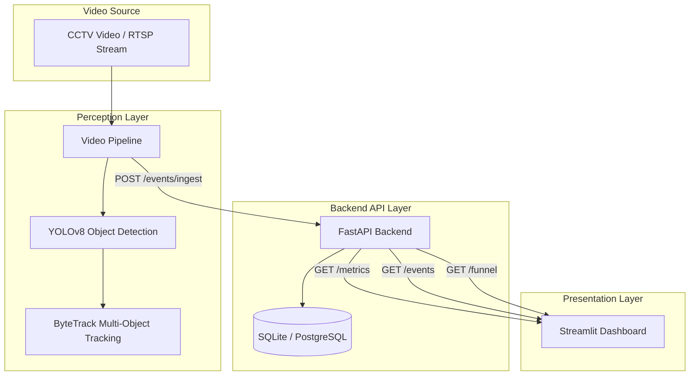

# Store Intelligence Architecture

## System Overview

The Store Intelligence platform is built on a decoupled, microservices-inspired architecture consisting of three primary layers:
1. **AI Perception Layer (Pipeline)**
2. **Backend API & Persistence Layer**
3. **Frontend Analytics Layer (Dashboard)**

This separation of concerns ensures that heavy computer vision workloads (YOLOv8 + ByteTrack) do not block the API event loop, and allows each component to scale independently.

## High-Level Architecture Diagram

## Component Breakdown

### 1. Perception Layer (Video Pipeline)
*   **Technologies:** OpenCV, PyTorch, Ultralytics YOLOv8, ByteTrack
*   **Responsibility:** Ingests video frames, detects humans (class 0), tracks individuals across frames to assign unique IDs, and calculates spatial relationships (e.g., zone intersections).
*   **Event Generation:** Instead of directly writing to the database, the pipeline aggregates events (entries, zone_enters, exits) and batches them via asynchronous HTTP POST requests to the backend API.

### 2. Backend API Layer
*   **Technologies:** Python, FastAPI, SQLAlchemy, Pydantic
*   **Responsibility:** Serves as the central nervous system. It receives raw telemetry events from the perception layer, validates schemas via Pydantic, and persists them into the database.
*   **Sessionization Engine:** As events arrive, the API intelligently constructs "Visitor Sessions". It calculates metrics like Dwell Time, Queue Depth, and Conversion Rates on the fly.

### 3. Presentation Layer
*   **Technologies:** Python, Streamlit, Plotly, Custom HTML/CSS
*   **Responsibility:** Provides a real-time, responsive, enterprise-grade UI. It polls the FastAPI backend for aggregated metrics and renders dynamic visualizations including Funnels, Heatmaps, and Anomaly Alerts.

## Data Flow (Visitor Lifecycle)

1. **Detection:** A person enters the camera frame. YOLOv8 detects the bounding box.
2. **Tracking:** ByteTrack assigns `track_id=15`.
3. **Entry Event:** The person crosses the designated `ENTRY_MAIN` line. The pipeline triggers an `entry` event.
4. **Ingestion:** API receives the event and creates a new Visitor Session.
5. **Zone Interactions:** The person moves into `AISLE_A`. Pipeline sends a `zone_enter` event. API updates the session dwell time.
6. **Dashboard Update:** Streamlit UI polls `/metrics/occupancy` and updates the Heatmap and Active Visitor count instantly.
