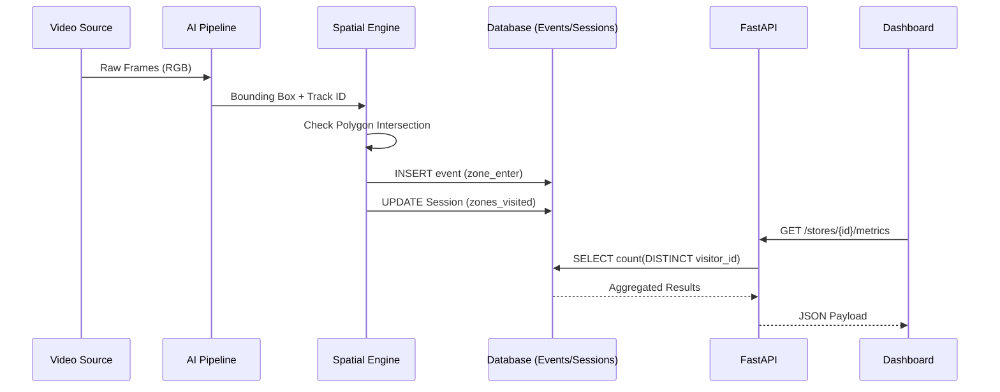

# Architecture Documentation

## 1. High-Level System Architecture

The Store Intelligence System is built as a highly decoupled, modular pipeline separating the heavy AI perception layer from the business reasoning layer.

### Core Components
1. **Perception Engine (YOLOv8 + ByteTrack)**
   - Captures raw video frames via OpenCV.
   - Detects persons using Ultralytics YOLOv8.
   - Tracks individuals across frames using ByteTrack, utilizing a 90-frame occlusion buffer to prevent ID switching during brief occlusions.

2. **Reasoning & Event Engine**
   - Applies spatial geometries (Excel-defined polygons) to the tracked bounding boxes.
   - Computes intersection over union (IoU) to determine precise entry/exit events.
   - Deduplicates events using a strict line-crossing heuristic.
   - Broadcasts structured JSON events (`zone_enter`, `zone_exit`, `entry`, `exit`).

3. **Data Layer (PostgreSQL / SQLite)**
   - Stores immutable raw events.
   - Uses optimized schemas with `visitor_id` and `store_id` partitioning.
   - Manages stateful sessions to reconstruct visitor journeys (Funnels).

4. **API Layer (FastAPI)**
   - Exposes RESTful endpoints conforming to strict evaluation schemas.
   - Handles aggregation queries (Occupancy, Heatmaps) using optimized SQL.
   - Gracefully handles database unavailability with `503` structured fallback.

5. **Presentation Layer (Streamlit)**
   - Auto-refreshing, reactive UI.
   - Uploads videos directly to the backend pipeline.
   - Visualizes live analytics without relying on static mock data.

## 2. Event & Data Flow

## 3. Queue & Occupancy Logic
- **Occupancy:** Calculated strictly as `MAX(0, Total Entries - Total Exits)` per zone. Evaluated live from the immutable event log.
- **Queue Logic:** Tracks the current occupancy of the `CHECKOUT` zone. If dwell time exceeds 300s, an anomaly is raised.

## 4. Anomaly Logic
- **Overcrowding:** Zone current occupancy > 90% capacity for > 60s.
- **Loitering:** Dwell time in entry/exit zones > 120s.
- **Long Dwell:** Dwell at checkout > 300s.
- **Group Entry:** >3 simultaneous unique IDs triggering entry events within a 2-second window.

## 5. Visitor Lifecycle Flow
1. **Unknown:** Person appears in camera feed, ByteTrack assigns a provisional ID.
2. **Tracked:** Person successfully crosses a zone boundary. `zone_enter` generated.
3. **Session Created:** A UUID session is attached to the physical track ID.
4. **Journeys:** Person moves between zones. Session array `zones_visited` is updated.
5. **Exit:** Person crosses an exit boundary or track is lost for >90 frames. `zone_exit` generated. Session marked `is_complete = True`.
