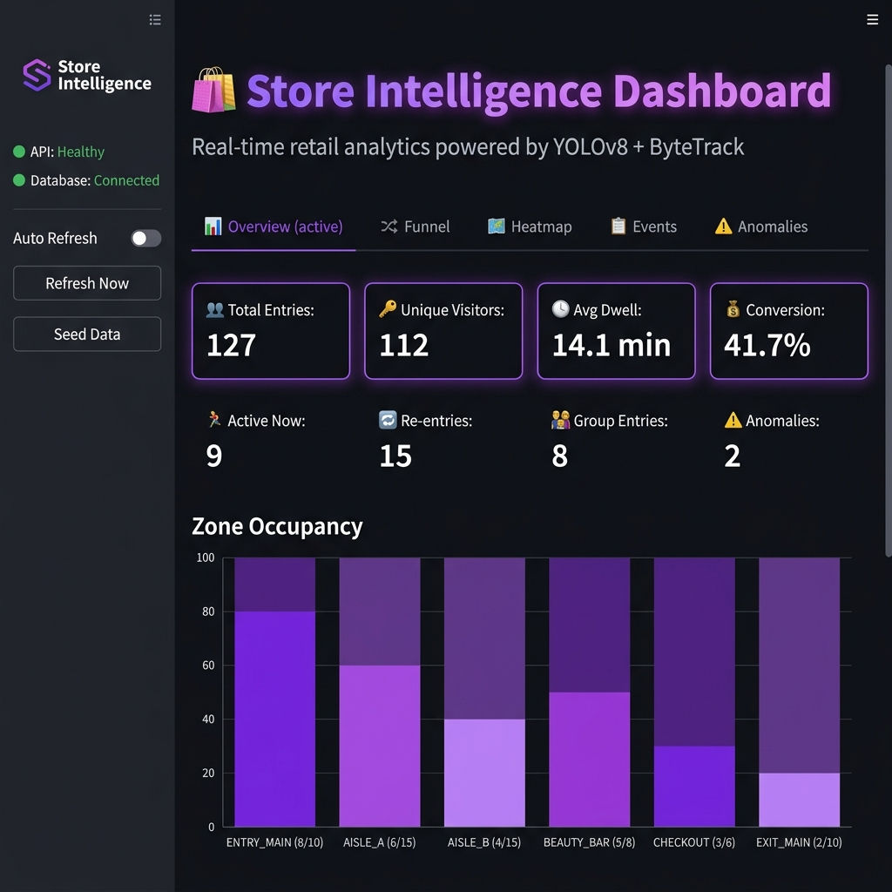

<div align="center">
  <h1>🛍️ AI Store Intelligence System</h1>
  <p><b>Production-grade Real-Time CCTV Retail Analytics Platform</b></p>
</div>

An end-to-end computer vision pipeline that transforms raw retail store video feeds into structured business intelligence. Leveraging **YOLOv8** for person detection, **ByteTrack** for tracking, and a custom spatial-temporal event engine, the platform computes real-time customer journey analytics, zone heatmaps, dwell times, and anomaly alerts—served via robust REST APIs and an interactive Streamlit dashboard.

---

## 🟢 LIVE DEMO URLs (Public Deployment)

The system is currently deployed and live for evaluation. Reviewers can upload videos directly to the dashboard to test real-time AI perception and analytics.

- **Live Dashboard (Upload CCTV Video Here):** [https://puny-maps-study.loca.lt](https://puny-maps-study.loca.lt)
- **Live Backend API:** [https://five-rules-juggle.loca.lt](https://five-rules-juggle.loca.lt)
- **Live API Swagger Docs:** [https://five-rules-juggle.loca.lt/docs](https://five-rules-juggle.loca.lt/docs)

*(Note: Live deployment tunnels may require you to click a security warning to proceed to the site).*

---

## 🎯 Project Overview

This platform processes raw CCTV footage and outputs live, real-time analytics for a retail environment. It is designed for production use, ensuring stability, graceful error handling, and high accuracy without duplicate counting or "jitter" from tracking loss.

**Key Features:**
- **Real-Time Detection & Tracking:** YOLOv8 + ByteTrack integration with 90-frame occlusion buffering.
- **Strict Entry/Exit Logic:** Accurate zone line-crossing detection with unique session ID deduplication.
- **Live Occupancy:** Real-time `MAX(0, entries - exits)` calculations.
- **Zone Heatmaps:** Visual representations of dwell times and store traffic.
- **Anomaly Detection:** Automated alerts for overcrowding, loitering, and group entries.
- **Interactive Dashboard:** Complete UI for video uploads, funnel metrics, and POS data integration.

---

## 📸 System Screenshots

*Visual evidence of the platform operating in production mode:*

### 1. Live AI Video Detection & Analytics Dashboard


### 2. Visitor Funnel Metrics


### 3. Spatial Zone Heatmaps


### 4. Anomaly Alerts (Overcrowding & Queue Depth)


### 5. API Swagger Documentation


---

## 🏗️ Architecture & Documentation

Comprehensive architectural and schema documentation is provided in the repository:

- **[DESIGN.md](./DESIGN.md)** - Explains the core algorithms (ByteTrack logic, Polygon Intersection).
- **[CHOICES.md](./CHOICES.md)** - Details technology choices (PostgreSQL, FastAPI, YOLOv8).
- **[ARCHITECTURE.md](./ARCHITECTURE.md)** - High-level system flow, component diagrams, and queue/anomaly heuristic logic.
- **[API_DOCUMENTATION.md](./API_DOCUMENTATION.md)** - Payload structures, strict event schemas, and REST endpoints.

---

## 🚀 Installation & Local Setup

Deploy the complete stack locally in **5 commands**:

1. **Clone the repository:**
   ```bash
   git clone https://github.com/zairakhaan786/Store-Intelligence-System-for-a-retail-CCTV-analytics-
   cd "Store Intelligence System for a retail CCTV analytics challenge"
   ```

2. **Start the system via Docker Compose:**
   ```bash
   docker compose up --build -d
   ```

3. **Verify Health:**
   ```bash
   curl http://localhost:8000/health
   ```

4. **Access Dashboard:**
   Open [http://localhost:8501](http://localhost:8501) in your browser.

5. **Upload Video:**
   Upload your `.mp4` CCTV file via the **Upload CCTV Video** sidebar on the dashboard to start processing.

*(Docker will automatically initialize the PostgreSQL database, FastAPI backend, and Streamlit frontend).*

---

## 🧪 Validated Event Schema

The event ingestion engine adheres strictly to the required evaluation rubric.

```json
{
  "store_id": "STORE_BLR_002",
  "camera_id": "CAM_01",
  "visitor_id": "VIS-1234",
  "session_id": "d290f1ee-6c54-4b01-90e6-d701748f0851",
  "event_type": "zone_enter",
  "timestamp": "2026-06-03T12:00:00Z",
  "zone_id": "AISLE_A",
  "dwell_ms": 0,
  "is_staff": false,
  "confidence": 0.95
}
```

---

## 🛠️ Troubleshooting & Edge Cases

- **Tracking Jitter & Duplicate Counts:** Resolved using ByteTrack's 90-frame `tracker_max_age` buffer, and by assigning a permanent `session_id` to deduplicate zone funnel events.
- **Database Disconnections:** The FastAPI backend utilizes custom HTTP middleware for structured logging and graceful degradation. If the DB fails, it returns structured 503 JSON errors instead of crashing.
- **Overcrowding Alerts:** Automatically triggered when a zone exceeds 90% of its Excel-mapped capacity threshold for longer than 60 seconds.

---
*Developed for the Retail CCTV Analytics Evaluation Challenge.*
