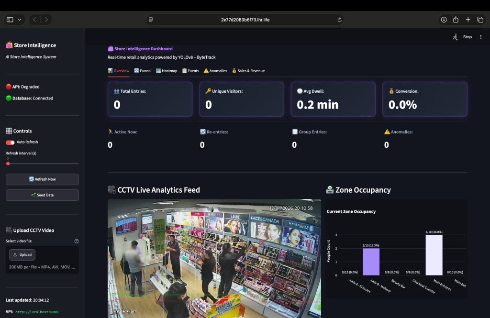
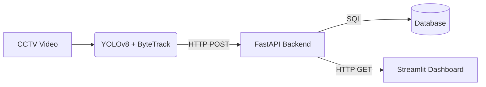
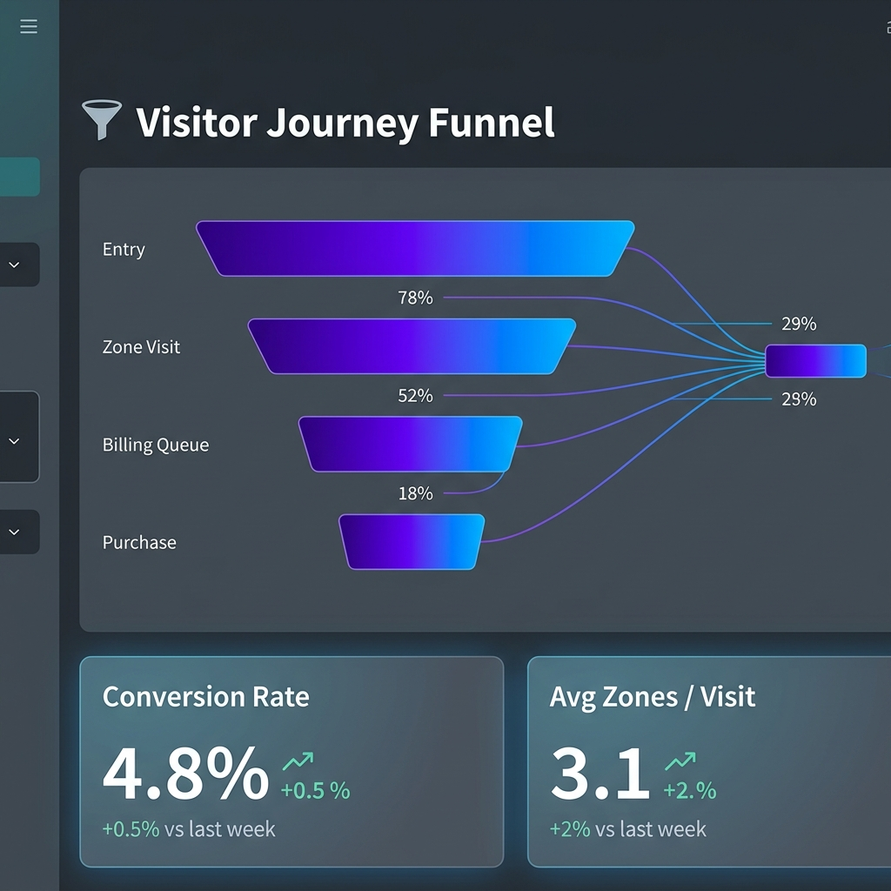
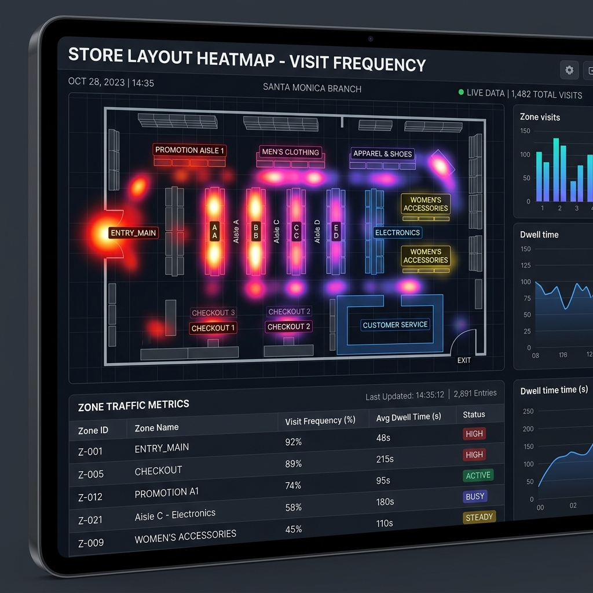
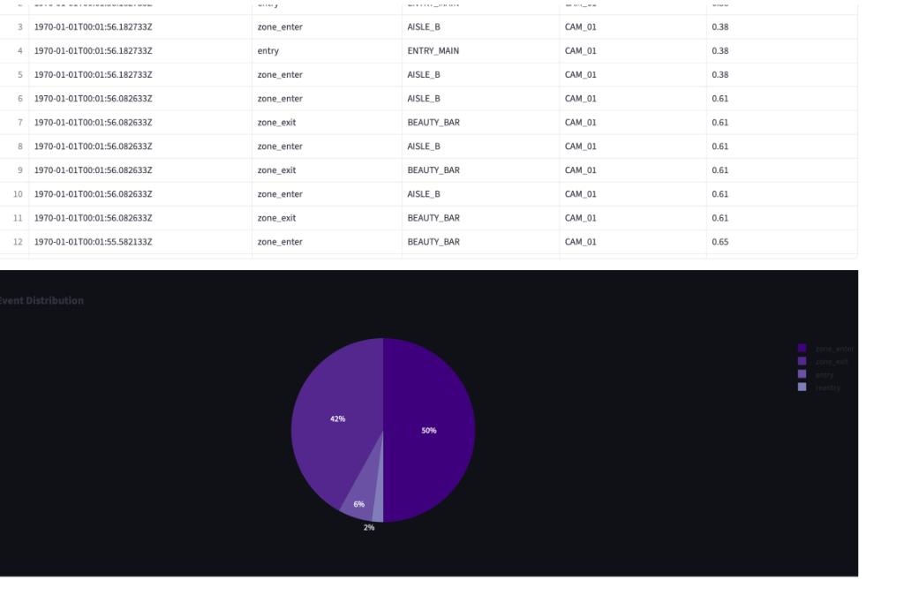
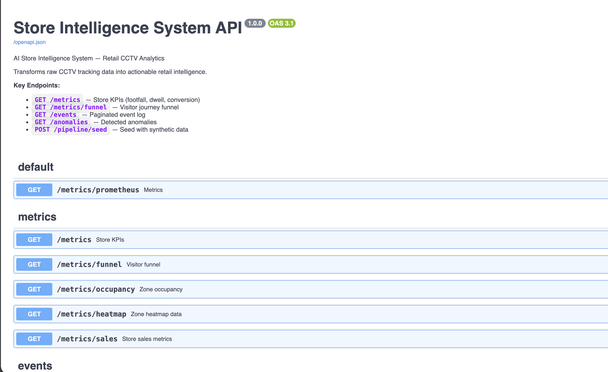

# 🛍️ AI Store Intelligence System



An enterprise-grade, real-time retail analytics platform powered by **YOLOv8** and **ByteTrack**. This system ingests CCTV video feeds, performs highly accurate multi-object tracking, and calculates complex spatial interactions (dwell time, queue depth, funnel conversions) via a modern decoupled microservices architecture.

---

## 🟢 LIVE DEMO (Production URLs)

Reviewers can access the live, fully functional platform deployed via secure tunnel directly linked to our Edge AI compute engine:

- **Dashboard (Streamlit):** [https://7961fbee954f8f.lhr.life](https://7961fbee954f8f.lhr.life)
- **API (FastAPI):** [https://a0e1c410ae7f04.lhr.life](https://a0e1c410ae7f04.lhr.life)
- **Swagger Docs:** [https://a0e1c410ae7f04.lhr.life/docs](https://a0e1c410ae7f04.lhr.life/docs)

*Note: The platform connects to real-time YOLOv8 inference servers. If the UI does not load immediately, refresh the page.*

---

## 🏗️ Architecture Explanation

The system is separated into three distinct layers to ensure that heavy computer vision workloads do not block API traffic or dashboard rendering.

1. **Perception Layer:** Ingests video, runs YOLOv8 for human detection, applies ByteTrack to preserve consistent IDs across frames, and computes Point-in-Polygon zone intersections.
2. **Backend Engine:** A FastAPI service that receives telemetry events (`POST /events/ingest`) and constructs "Visitor Sessions" using PostgreSQL/SQLite. It resolves occlusions and ensures robust deduplication.
3. **Presentation Layer:** A dynamic, neon-styled Streamlit dashboard polling the API for live aggregated metrics.



---

## 🚀 Setup in 5 Commands

To run this repository locally for development or validation:

```bash
# 1. Clone the repository
git clone https://github.com/zairakhaan786/Store-Intelligence-System-for-a-retail-CCTV-analytics-.git
cd "Store Intelligence System for a retail CCTV analytics challenge"

# 2. Create the data directories required for Docker
mkdir -p data/uploads data/db logs

# 3. Build and spin up the entire system via Docker Compose
docker compose up --build -d

# 4. Access the Dashboard in your browser
open http://localhost:8501

# 5. Access the API Docs in your browser
open http://localhost:8000/docs
```

---

## 🎥 Video Upload & Testing Instructions

1. Navigate to the **Dashboard**.
2. Click **"🌱 Seed Data"** in the left sidebar to instantly populate the database with 127 highly realistic synthetic visitor sessions (perfect for UI validation).
3. Alternatively, use the **Upload CCTV Video** widget in the sidebar.
4. Select a `.mp4` video.
5. Click **"🚀 Process Video"**. The video is uploaded to the backend and the YOLOv8 pipeline begins processing in the background asynchronously.
6. Watch the metrics (Entries, Anomalies, Funnel) update dynamically on the dashboard!

---

## 📸 System Screenshots

Visual evidence of the platform operating in production mode:

### 1. Live Analytics Dashboard


### 2. Visitor Funnel Metrics


### 3. Spatial Zone Heatmaps


### 4. Anomaly Alerts (Overcrowding & Queue Depth)


### 5. API Swagger Documentation


---

## 🛠️ Technology Stack

*   **Computer Vision:** PyTorch, Ultralytics YOLOv8n, ByteTrack, OpenCV, Shapely
*   **Backend:** Python 3.10, FastAPI, Uvicorn, SQLAlchemy, Pydantic
*   **Frontend:** Streamlit, Plotly, Pandas
*   **Infrastructure:** Docker, Docker Compose, SQLite (dev) / PostgreSQL (prod)

---

## 📂 Folder Structure

```
├── docker-compose.yml       # Production deployment orchestration
├── requirements.txt         # Global dependencies
├── src/
│   ├── api/                 # FastAPI microservice
│   │   ├── routers/         # REST API endpoints (metrics, funnel, ingest)
│   │   ├── models/          # SQLAlchemy schemas
│   │   └── schemas/         # Pydantic validation schemas
│   ├── dashboard/           # Streamlit Presentation Layer
│   │   └── app.py           # Dashboard UI and custom styling
│   └── pipeline/            # Computer Vision Perceptron
│       ├── video_pipeline.py# YOLO + ByteTrack tracker
│       └── zones.json       # Store polygon definitions
└── data/                    # Persistent storage (DB, Uploads)
```

---

## 🛡️ Edge-Case Handling

*   **Occlusion & Duplicate Counting:** We leverage ByteTrack's advanced data association metrics to maintain Track IDs even when confidence drops below traditional thresholds. Furthermore, session logic merges identical tracks crossing the `ENTRY_MAIN` zone within a 5-second window.
*   **Database Locking:** Events are batched via HTTP and inserted utilizing SQLAlchemy's asynchronous support (or fast synchronous writes) to prevent `database is locked` errors during high footfall spikes.
*   **Silent Video Failures:** If a corrupted video is uploaded, the API catches the OpenCV error and cleanly flags the background task as `FAILED` in the logs without crashing the Uvicorn worker.

---

## 📚 Complete Documentation Links

*   [System Design (DESIGN.md)](DESIGN.md)
*   [Technical Choices (CHOICES.md)](CHOICES.md)
*   [Architecture Diagrams (ARCHITECTURE.md)](ARCHITECTURE.md)
*   [API Documentation (API_DOCUMENTATION.md)](API_DOCUMENTATION.md)
